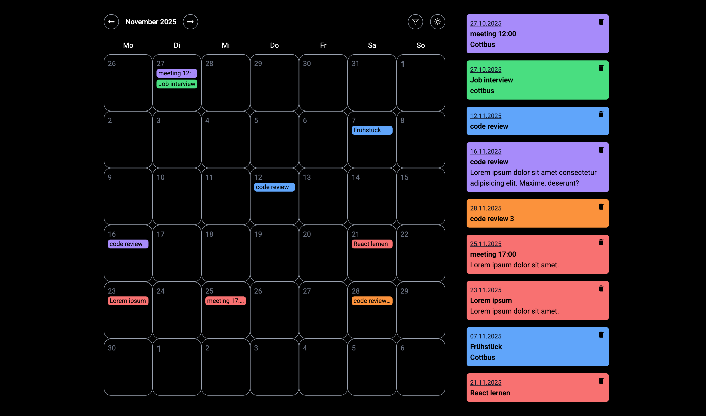
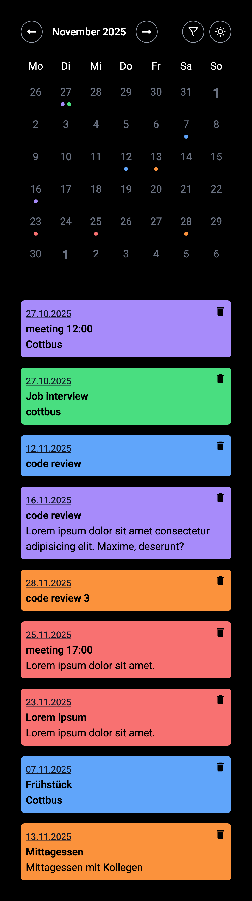

# Description

A small project to practice **React**, **state management**, and working with the **date-fns** library.  
The app provides a simple calendar where users can create, view, filter, and manage events.

## Screenshots

### Desktop

### Mobile

## Video-Demo

https://youtu.be/gyWHq6nQ3Gw

## Features

- Add events to specific days
- Filter events by color
- Light / Dark mode toggle
- Persistent storage via localStorage
- Responsive layout (mobile + desktop)

## What I Learned

- Working with **React component structure**
- Using **Zustand** for lightweight state management
- Handling **nested data filtering**
- Understanding and implementing **date-fns** helpers (e.g. `isSameDay`)
- Prop-drilling vs. local component state
- Managing reusable UI components

## Technologies

- HTML
- TailwindCSS
- Javascript
- React
- Zustand
- date-fns
